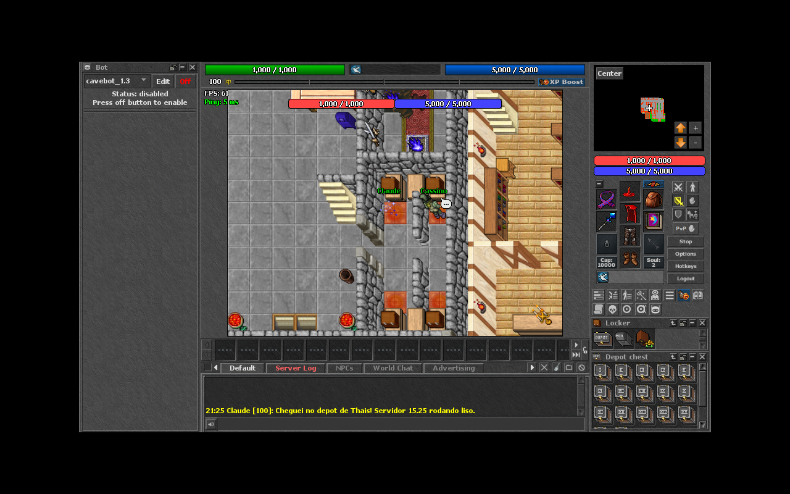
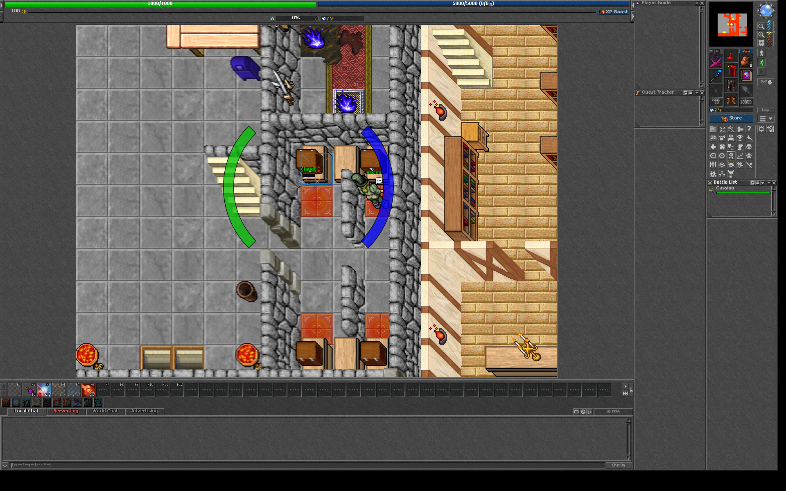

# 🐉 Tibia OT Server — Global (client 15.25)

Servidor de Tibia completo (estilo **Global**), baseado no [Canary](https://github.com/opentibiabr/canary) da OpenTibiaBR — o emulador mais atualizado da comunidade. Este repositório acompanha a branch de desenvolvimento (`main`), que fala o protocolo do **client Tibia 15.25** (`CLIENT_VERSION = 1525`), a versão mais próxima do Tibia atual disponível no projeto. Inclui o datapack global completo (mapa do Tibia real, monstros, NPCs, quests, bosses, hunts).

> 📄 O README original do projeto Canary foi preservado em [`CANARY.md`](CANARY.md).

## ℹ️ Sobre as versões (importante)

Existem **dois números** que costumam ser confundidos:

| Número | O que é | Aqui |
|---|---|---|
| Versão do Canary (ex: 3.6.1) | Versão do software servidor | build da `main` |
| `CLIENT_VERSION` (ex: 1525 = 15.25) | Protocolo do client Tibia que o servidor aceita | **15.25** |

- O client OT mais novo publicado é o **15.25** — não existe 15.3 como client de OT server ainda, então **15.25 é o mais próximo do Tibia oficial atual**.
- A imagem Docker `ghcr.io/opentibiabr/canary:latest` é construída a partir da `main` e **já aceita o client 15.25**.
- O servidor também aceita o protocolo legado **11.00** (`allowOldProtocol = true`), útil para clients antigos e testes.

## ✅ Testado e funcionando

Validado de ponta a ponta em Ubuntu 24.04 (binário oficial + MariaDB):

- Banco criado a partir do `schema.sql` — 48 tabelas, conta `god` presente;
- Datapack **global completo** (client 15.25) carregado com o mapa `otservbr.otbm` (177 MB), badges, títulos e todos os módulos Lua — **zero erros no log**;
- Log final: `OTServBR-Global server online!`;
- Personagem **entrou em jogo** (Templo de Thais), andou e falou no chat;
- Portas **7171** (login) e **7172** (game) aceitando conexões; ~1,3 GB de RAM em uso;
- **Caminhada e interação validadas**: do templo de Thais (32369,32241,7) até o depot (32352,32226,7), com o *Locker* e o *Depot chest* abrindo normalmente.



### Client 15.25 oficial conectado

O client gráfico oficial **15.25** também foi validado contra este servidor —
login completo, mundo carregado e todos os sistemas modernos na interface
(Store, Cyclopedia, Bestiary, Bosstiary, Charms, Prey, Imbuements, Forge,
Wheel of Destiny):



Registro no log do servidor:

```
Claude has logged in. (Protocol: 1525, Profile: current)
```

As ferramentas usadas nessa validação (o serviço de login HTTP que o client
15.x exige e um client de protocolo sem interface gráfica) estão em
[`tools/protocol/`](tools/protocol/).

> 🖼️ Já o screenshot em [`docs/images/servidor-em-jogo.png`](docs/images/servidor-em-jogo.png) usa sprites antigos (10.99) via protocolo legado 11.00 — foi a primeira prova de login, feita antes de subir o client moderno.

---

## 🚀 Rodando o servidor em minutos (Docker — sem compilar nada)

O jeito mais fácil: o Docker baixa o servidor pronto (já em 15.25), o banco, o site e o mapa automaticamente.

### 1. Instale o Docker

- **Windows/Mac:** [Docker Desktop](https://docs.docker.com/get-started/get-docker/)
- **Linux:** Docker Engine + Docker Compose v2

### 2. Clone este repositório

```bash
git clone https://github.com/cardosomatheus1/tibia.git
cd tibia/docker
```

### 3. Suba tudo

**Windows (PowerShell):**
```powershell
.\up.ps1
```

**Linux/macOS:**
```bash
sh ./up.sh
```

A primeira vez demora alguns minutos (baixa as imagens, monta o site e baixa o mapa global). Acompanhe com `docker compose logs -f server`.

### 4. O que fica no ar

| Serviço | Endereço |
|---|---|
| Site + painel admin (MyAAC) | http://localhost:8080 |
| Login do client | http://localhost:8088/login |
| Porta do jogo | 7172 (login 7171, status 7173) |
| Banco MariaDB | interno (volume Docker) |

### 5. Contas padrão (⚠️ apenas para teste local!)

| Conta | Login | Senha |
|---|---|---|
| God (acesso total in-game) | `god` | `god` |
| Conta de teste | `@test1` | `test` |
| Admin do site MyAAC | `myaacadmin` | `admin123` |

---

## 🎮 Client 15.25 (para jogar com o visual moderno)

Baixe o client **15.25** — o mais próximo do Tibia atual:

1. **[Game Client 15.25 (dudantas)](https://github.com/dudantas/tibia-client/releases/latest)** — client oficial adaptado para OT, já vem com os assets/sprites da 15.25. **Recomendado.** Configure o endereço de login para `http://localhost:8088/login`.
2. **[OTClient Redemption (mehah)](https://github.com/mehah/otclient)** — client open source, altamente customizável, suporta protocolos 7.72 a 15.x.

### Jogando de outro PC da rede local

```powershell
.\up.ps1 -Lan          # Windows
```
```bash
LAN=true sh ./up.sh    # Linux/macOS
```

No outro PC, use `http://IP_DA_MAQUINA:8088/login` no client e `http://IP_DA_MAQUINA:8080` para o site.

---

## ⚙️ Configurando o seu servidor

- **`docker/.env`** — nome do servidor, IP anunciado, portas, senhas do banco e do site. Criado automaticamente a partir de [`docker/.env.dist`](docker/.env.dist).
- **`config.lua.dist`** — todas as configurações do jogo (rates de XP/skill/loot, PvP, housing, `allowOldProtocol`, etc.). Copie para `config.lua` se rodar fora do Docker.
- **`data-otservbr-global/`** — o coração do jogo: scripts Lua de quests, monstros, NPCs, raids, eventos. É aqui que você customiza o conteúdo.
- **`schema.sql`** — estrutura do banco (importada automaticamente no Docker).

---

## 🌍 Colocando online (VPS)

1. Contrate um VPS Linux (Ubuntu 24.04, mínimo 2 vCPU / 4 GB RAM; recomendado 4 vCPU / 8 GB).
2. Instale Docker e clone este repositório.
3. Edite `docker/.env`:
   - `CANARY_SERVER_IP` = IP público do VPS
   - `CANARY_TEST_ACCOUNTS=false`
   - Troque **todas** as senhas (`CANARY_DB_PASSWORD`, `CANARY_DB_ROOT_PASSWORD`, `MYAAC_ADMIN_PASSWORD`)
4. Libere as portas TCP no firewall: `7171`, `7172`, `8080`, `8088`.
5. `sh ./up.sh` e pronto.

> ⚠️ O quickstart Docker foi pensado para testes/LAN. Para produção séria, leia [`docker/DOCKER.md`](docker/DOCKER.md) e a [documentação oficial](https://docs.opentibiabr.com/).

---

## 🔨 Compilando do código-fonte (para garantir 15.25 nativo)

Como este repositório está na branch `main`, compilar do fonte gera um servidor **client 15.25** nativo:

- **Windows:** Visual Studio 2022 + vcpkg — [guia oficial](https://docs.opentibiabr.com/opentibiabr/projects/canary/getting-started)
- **Linux:** CMake + vcpkg (`./recompile.sh` como atalho)

Para forçar o Docker a compilar da fonte local (em vez de baixar a imagem pronta), use os `Dockerfile.x86`/`Dockerfile.dev` em [`docker/`](docker/).

---

## 🧰 Ferramentas úteis

| Ferramenta | Para quê |
|---|---|
| [Assets Editor](https://github.com/Arch-Mina/Assets-Editor) | Editar sprites/assets do client (Tibia 12+/15) |
| [Remere's Map Editor](https://github.com/opentibiabr/remeres-map-editor/) | Editar o mapa |
| [ClientConverter](https://github.com/Arch-Mina/ClientConverter) | Converter sprite sheets ↔ .spr/.dat |
| [OpenTibia Sprite Pack](https://github.com/peonso/opentibia_sprite_pack) | Sprites **livres** (CC-BY 4.0) para projetos próprios |
| [OTLand](https://otland.net/) | Maior fórum da comunidade OT |

---

## 📁 Estrutura do repositório

```
├── docker/                  # Quickstart Docker (server + banco + site + login)
├── data-otservbr-global/    # Datapack global (quests, monstros, NPCs, scripts)
├── data-canary/             # Datapack mínimo de testes
├── data/                    # Bibliotecas Lua compartilhadas (core)
├── src/                     # Código-fonte C++ do servidor (CLIENT_VERSION = 1525)
├── schema.sql               # Estrutura do banco de dados
├── config.lua.dist          # Modelo de configuração do servidor
└── CANARY.md                # README original do projeto Canary
```

---

## 📜 Créditos e licença

- Baseado no [Canary](https://github.com/opentibiabr/canary) (branch `main`, client 15.25), da comunidade [OpenTibiaBR](https://github.com/opentibiabr) — licença **GPL-2.0** (mantida em [`LICENSE`](LICENSE)).
- Tibia é marca registrada da CipSoft GmbH. Os assets/sprites originais do Tibia pertencem à CipSoft — este repositório contém apenas o emulador open source e dados da comunidade.
