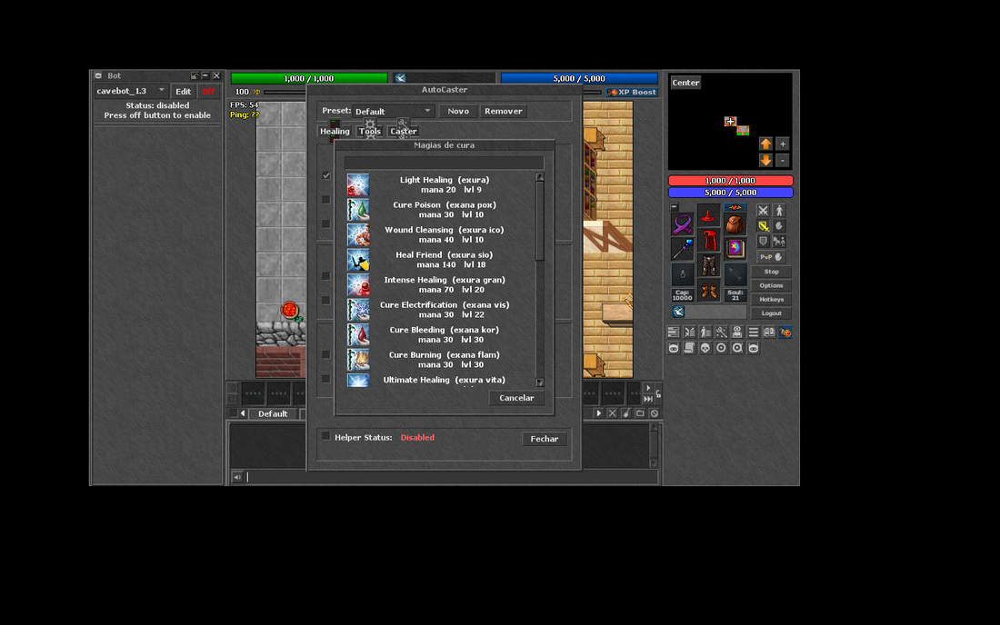
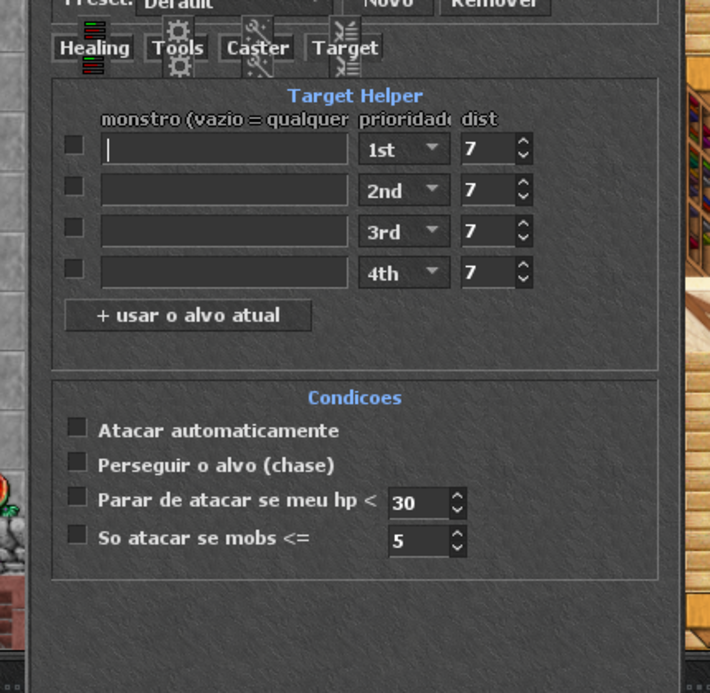
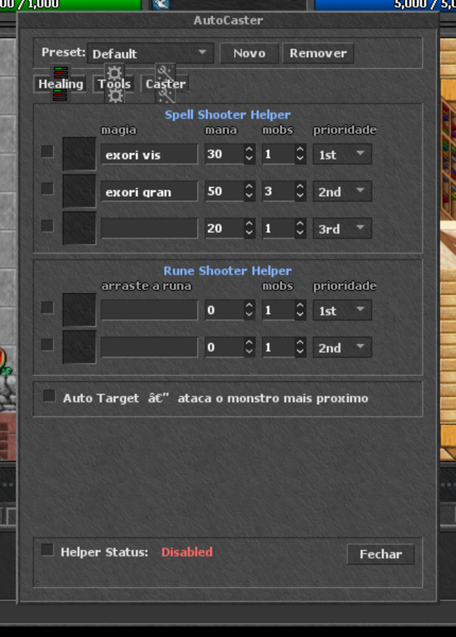

# AutoCaster — semibot de assistência (estilo RTCaster)

Módulo de client no formato do **RTCaster do RubinOT**: automatiza a
*execução* das ações de combate (curar, beber potion, dar sio, atacar),
mas **não** automatiza a navegação — não existe cavebot aqui, de propósito.
É a mesma linha que o RubinOT adota: assistência é permitida, jogar sozinho
não.


## Instalação

Copie a pasta para o diretório `modules/` do seu client OTClient:

```bash
cp -r client-modules/autocaster /caminho/do/client/modules/
```

Reinicie o client. O módulo carrega sozinho (`autoload: true`) e cria um
botão na barra lateral, junto dos outros. Atalho: **Ctrl+Shift+A**.

Funciona no **OTClientV8** e no **otclient do mehah** — só usa APIs de
núcleo (`g_game`, `g_map`, `g_ui`), sem depender do framework de bot do
OTCv8.

## As três abas

### Seleção visual de magias

Clique no ícone de uma linha de magia e abre a lista de **todas as magias
daquele tipo** (cura, ataque ou suporte), cada uma com a **mesma arte que
aparece na hotkey**, mais mana e level exigidos, ordenadas por level. Tem
campo de filtro no topo.



A lista sai do `SpellInfo` do próprio client e os ícones do sprite sheet
`SpelllistSettings.iconFile`, recortados com `Spells.getImageClip()` — ou
seja, acompanha automaticamente as magias que o seu client conhece. O
filtro por tipo usa o campo `group` de cada magia: `1` ataque, `2` cura,
`3` suporte.

A lista é **filtrada pela vocação e pelo level do personagem**: um
sorcerer só vê magias de sorcerer, um paladin só as de paladin. Personagem
sem vocação (GM) vê tudo.

> ⚠️ **Numeração de vocação:** o Canary manda para o client o `clientid`
> de `data/XML/vocations.xml`, que **não** é a numeração usada no
> `SpellInfo` do OTClient:
>
> | | knight | paladin | sorcerer | druid |
> |---|---|---|---|---|
> | clientid (Canary) | 1 | 2 | 3 | 4 |
> | SpellInfo (OTClient) | 4 | 3 | 1 | 2 |
>
> Sem converter, um sorcerer veria as magias de paladin. A tabela
> `VOC_CLIENT_PARA_SPELL` no `autocaster.lua` faz essa conversão (com
> fallback para servidores que já usam a numeração clássica).

Linhas de **runa e potion** mostram um slot de item no lugar do ícone —
basta arrastar o item para lá.

### Healing
- **Spell Healing** — 3 linhas: magia + limite de hp%. A de cima tem
  prioridade (útil para `exura gran` em 60% e `exura` em 80%).
- **Potion Healing** — 2 linhas com slot de item: a primeira usa **hp%**,
  a segunda **mp%**. Arraste a potion para o slot.
- **Friend Healing (party)** — cura o membro da party com menos vida:
  por magia (`exura sio`, que monta `exura sio "Nome`) ou por runa (UH),
  conforme você preencher o campo ou o slot.

### Tools
Auto Haste (com recast quando o buff cai), Change Gold, Auto Eat Food e
Anti Paralyze.

### Target (caça)

Onde fica a parte de mira. Uma lista de até 4 monstros, cada um com
**prioridade** (1st–5th) e **distância máxima** — o motor escolhe primeiro
pela prioridade e, em empate, pelo mais próximo. Deixar a lista vazia
significa "qualquer monstro serve".

O botão **+ usar o alvo atual** preenche a primeira linha livre com o nome
do monstro que você está atacando, sem precisar digitar.



Condições de segurança:

- **Atacar automaticamente** — liga a mira
- **Perseguir o alvo (chase)** — usa o chase mode nativo do client
- **Parar de atacar se meu hp <** — cancela o ataque quando a vida cai
- **Só atacar se mobs <=** — evita puxar treino demais

Quando o alvo morre ou some, ele escolhe o próximo sozinho. As magias da
aba Caster disparam sobre o alvo selecionado aqui.

> Repare no que **não** existe: waypoints e caminhada automática. O
> personagem só ataca o que está ao alcance — quem anda e escolhe a hunt
> é você.

### Caster
- **Spell Shooter** — 3 linhas: magia, mana mínima, número mínimo de
  monstros no alcance e prioridade (1st…5th).
- **Rune Shooter** — 2 linhas com slot de runa, mesmos critérios.
- **Auto Target** — ataca o monstro mais próximo (só seleciona o alvo,
  não anda atrás dele).



## Como o motor funciona

Um laço roda a cada 150 ms e avalia as regras **em ordem de prioridade**,
disparando **no máximo uma ação por ciclo** — é assim que os semibots de
verdade evitam estourar o cooldown do servidor:

1. cura por magia
2. potion (vida, depois mana)
3. cura de aliado
4. utilidades (haste, anti-paralyze)
5. shooter (magias e runas, ordenados pela prioridade escolhida)

Cada regra tem o próprio cooldown independente, guardado por chave. As
condições saem de `getHealthPercent()`, `getMana()/getMaxMana()` e de
`g_map.getSpectatorsInRange()` para contar monstros.

Tudo roda **no client** — o servidor não precisa de nenhuma alteração,
ele só recebe as mesmas mensagens que um jogador mandaria na mão.

## Configuração

As opções são salvas em `g_settings` (nó `autocaster`) e persistem entre
sessões. Para mudar os padrões, edite `regrasPadrao()`/`padroes()` no
início do `autocaster.lua`.

## Aviso

Isto é um **auxiliar**, não um bot completo. Se você for rodar um servidor
público, decida antes qual é a sua regra — o RubinOT, por exemplo, libera
esse tipo de assistência e pune cavebot. A ausência de navegação automática
aqui é intencional.
