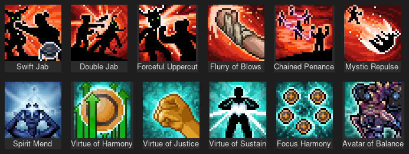
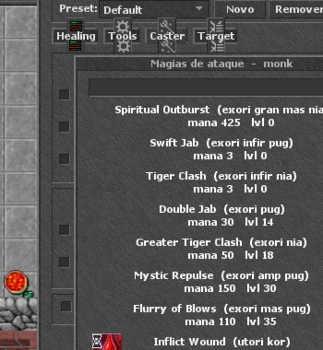

# AutoCaster — semibot de assistência (estilo RTCaster)

Módulo de client no formato do **RTCaster do RubinOT**: automatiza a
*execução* das ações de combate (curar, beber potion, dar sio, atacar),
mas **não** automatiza a navegação — não existe cavebot aqui, de propósito.
É a mesma linha que o RubinOT adota: assistência é permitida, jogar sozinho
não.


## Instalação

Copie a pasta para o diretório `modules/` do seu client OTClient:

```bash
cp -r client-modules/autocaster /caminho/do/client/modules/
```

Reinicie o client. O módulo carrega sozinho (`autoload: true`) e cria um
botão na barra lateral, junto dos outros. Atalho: **Ctrl+Shift+A**.

## Qual client usar

| Client | Protocolo | Aceita este módulo? |
|---|---|---|
| [otclient (mehah)](https://github.com/mehah/otclient) | 7.72 – **15.x** | ✅ sim — **é o caminho para 15.25** |
| OTClientV8 | até ~12.x | ✅ sim (foi onde validei em execução) |
| Client oficial 15.25 (dudantas) | 15.25 | ❌ não — é Qt/C++ fechado, sem módulos Lua |

O client oficial **não tem sistema de módulos**: ele é um executável Qt
compilado, então nenhum semibot pode ser adicionado a ele. É por isso que o
RubinOT precisou fazer o RTC — um client próprio. Para ter o AutoCaster
falando 15.25 com o Canary, use o **otclient do mehah**, que é open source
e suporta o protocolo 15.x.

O módulo só usa APIs de núcleo (`g_game`, `g_map`, `g_ui`) e trata as
diferenças entre os dois clients:

- **ícone da magia**: o mehah indexa o sprite sheet por `info.clientId`; o
  OTClientV8 usa `info.icon` resolvido em `SpellIcons`. O módulo tenta os
  dois.
- **vocação**: os dois clients recebem do Canary o `clientid` (opcode
  `0x9F` manda `vocation->getClientId()` em ambos os protocolos), e nenhum
  dos dois usa essa numeração nas suas tabelas de magia. Por isso a
  comparação é por nome.

### Ícones do Monk

Os ícones das magias de Monk existem no sheet do mehah
(`data/images/game/spells/spell-icons-32x32.png`, 187 ícones) — são as
magias com `clientId` 161–178:



No OTClientV8 elas aparecem sem ícone, porque o sheet dele é de 2023 e não
tem essa arte.

## As três abas

### Seleção visual de magias

Clique no ícone de uma linha de magia e abre a lista de **todas as magias
daquele tipo** (cura, ataque ou suporte), cada uma com a **mesma arte que
aparece na hotkey**, mais mana e level exigidos, ordenadas por level. Tem
campo de filtro no topo.


**A lista vem do seu servidor, não do client.** O `SpellInfo` que acompanha
o OTClient é uma tabela fixa e antiga — não conhece o **Monk** nem as
magias novas da 15.x. Por isso o `gerar_spells.py` lê
`data/scripts/spells/**/*.lua` e produz o `spells_servidor.lua`, que o
módulo carrega:

```bash
python3 client-modules/autocaster/gerar_spells.py
```

Rode de novo sempre que mexer nas magias do datapack. Hoje ele extrai 196
magias (69 de ataque, 25 de cura, 102 de suporte), incluindo as 44 do Monk.



Os **ícones** ainda saem do sprite sheet do client
(`SpelllistSettings.iconFile`, recortados com `Spells.getImageClip()`),
casados pelas palavras da magia. Magia que o client não conhece aparece sem
ícone — é o caso das de Monk num client antigo; num client 15.x elas
aparecem normalmente.

A lista é **filtrada pela vocação e pelo level do personagem**: um
sorcerer só vê magias de sorcerer, um paladin só as de paladin. Personagem
sem vocação (GM) vê tudo.

> ⚠️ **Vocação:** o servidor manda ao client o `clientid` de
> `data/XML/vocations.xml` — que **não** bate com a numeração do
> `SpellInfo` do OTClient (lá sorcerer é 1; no Canary o clientid 1 é
> knight). Por isso a comparação é feita **por nome**: a tabela `VOC_NOME`
> traduz o clientid para o nome da vocação e compara com a lista de cada
> magia, tratando promovida→base (elite knight usa o que knight usa).
> Cobre Monk e Exalted Monk, que nem existem na tabela do client.

Linhas de **runa e potion** mostram um slot de item no lugar do ícone —
basta arrastar o item para lá.

### Healing
- **Spell Healing** — 3 linhas: magia + limite de hp%. A de cima tem
  prioridade (útil para `exura gran` em 60% e `exura` em 80%).
- **Potion Healing** — 2 linhas com slot de item: a primeira usa **hp%**,
  a segunda **mp%**. Arraste a potion para o slot.
- **Friend Healing (party)** — cura o membro da party com menos vida:
  por magia (`exura sio`, que monta `exura sio "Nome`) ou por runa (UH),
  conforme você preencher o campo ou o slot.

### Tools
Auto Haste (com recast quando o buff cai), Change Gold, Auto Eat Food e
Anti Paralyze.

### Target (caça)

Onde fica a parte de mira. Uma lista de até 4 monstros, cada um com
**prioridade** (1st–5th) e **distância máxima** — o motor escolhe primeiro
pela prioridade e, em empate, pelo mais próximo. Deixar a lista vazia
significa "qualquer monstro serve".

O botão **+ usar o alvo atual** preenche a primeira linha livre com o nome
do monstro que você está atacando, sem precisar digitar.


Condições de segurança:

- **Atacar automaticamente** — liga a mira
- **Perseguir o alvo (chase)** — usa o chase mode nativo do client
- **Parar de atacar se meu hp <** — cancela o ataque quando a vida cai
- **Só atacar se mobs <=** — evita puxar treino demais

Quando o alvo morre ou some, ele escolhe o próximo sozinho. As magias da
aba Caster disparam sobre o alvo selecionado aqui.

> Repare no que **não** existe: waypoints e caminhada automática. O
> personagem só ataca o que está ao alcance — quem anda e escolhe a hunt
> é você.

### Caster
- **Spell Shooter** — 3 linhas: magia, mana mínima, número mínimo de
  monstros no alcance e prioridade (1st…5th).
- **Rune Shooter** — 2 linhas com slot de runa, mesmos critérios.
- **Auto Target** — ataca o monstro mais próximo (só seleciona o alvo,
  não anda atrás dele).


## Como o motor funciona

Um laço roda a cada 150 ms e avalia as regras **em ordem de prioridade**,
disparando **no máximo uma ação por ciclo** — é assim que os semibots de
verdade evitam estourar o cooldown do servidor:

1. cura por magia
2. potion (vida, depois mana)
3. cura de aliado
4. utilidades (haste, anti-paralyze)
5. shooter (magias e runas, ordenados pela prioridade escolhida)

Cada regra tem o próprio cooldown independente, guardado por chave. As
condições saem de `getHealthPercent()`, `getMana()/getMaxMana()` e de
`g_map.getSpectatorsInRange()` para contar monstros.

Tudo roda **no client** — o servidor não precisa de nenhuma alteração,
ele só recebe as mesmas mensagens que um jogador mandaria na mão.

## Configuração

As opções são salvas em `g_settings` (nó `autocaster`) e persistem entre
sessões. Para mudar os padrões, edite `regrasPadrao()`/`padroes()` no
início do `autocaster.lua`.

## Aviso

Isto é um **auxiliar**, não um bot completo. Se você for rodar um servidor
público, decida antes qual é a sua regra — o RubinOT, por exemplo, libera
esse tipo de assistência e pune cavebot. A ausência de navegação automática
aqui é intencional.
