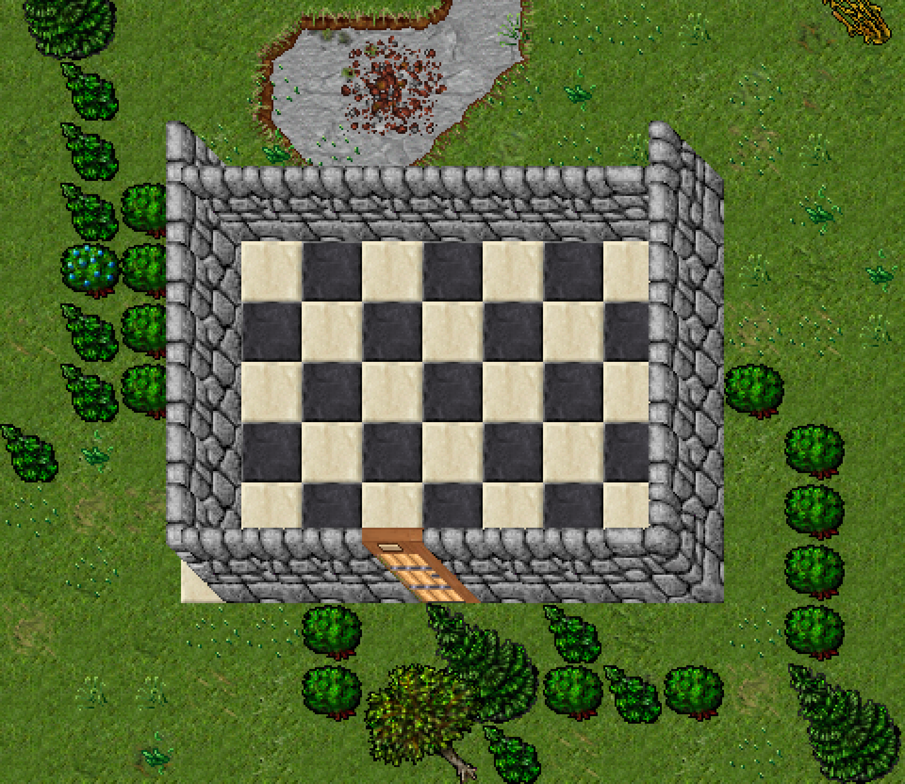
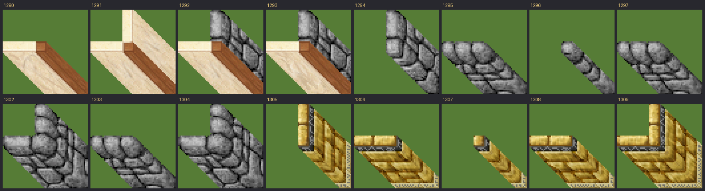
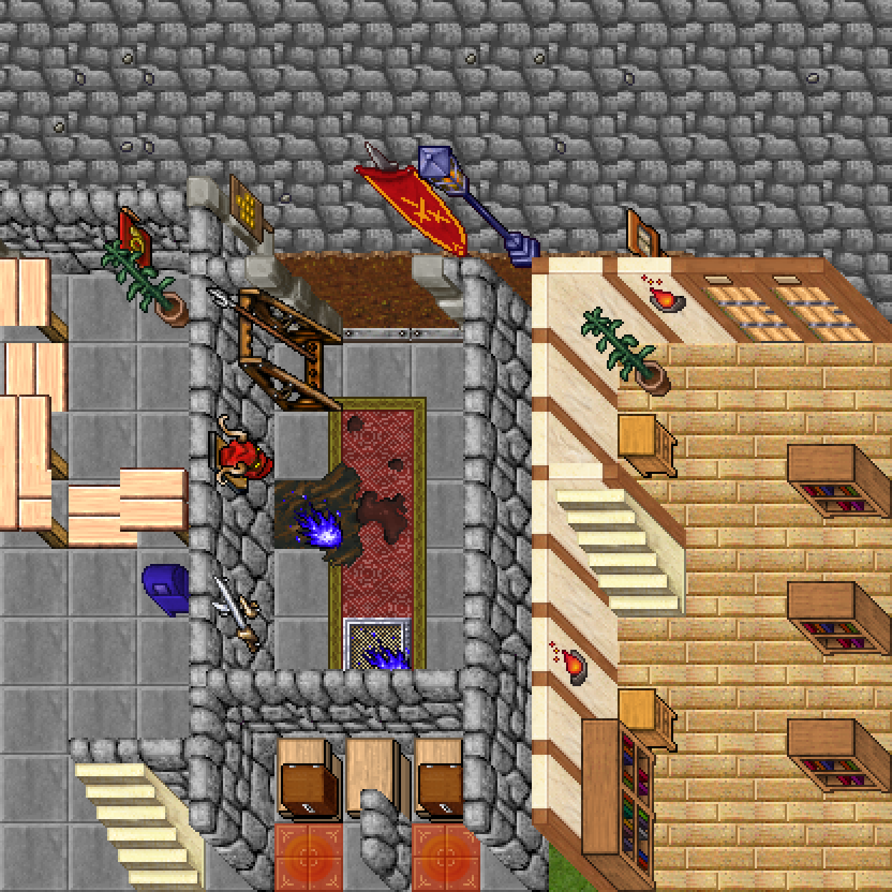

# Editar o mapa (OTBM) por script

Ferramentas para ler e editar `otservbr.otbm` direto nos bytes — sem abrir
o Remere's Map Editor, e sem carregar os 177 MB inteiros na memória de um
parser lento.



Acima: uma construção feita por script e renderizada **antes** de subir o
servidor. Parede de pedra, chão de mármore em xadrez e porta ao sul.

## O formato, em resumo

O OTBM é uma árvore de nós com marcadores no meio do fluxo de bytes:

| Byte | O que é |
|---|---|
| `0xFE` | começa um nó, seguido do byte de tipo |
| `0xFF` | fecha o nó |
| `0xFD` | escapa o próximo byte (quando o dado vale FD/FE/FF) |

A hierarquia que interessa é `raiz > map data > tile area > tile > item`.
Cada **tile area** cobre 256×256 e guarda a posição base `(x, y, z)`;
dentro dela cada **tile** guarda só o deslocamento de 1 byte em x e y. O
chão vem como atributo do tile (`0x09` + id em u16) e o resto empilhado
como nós de item.

Um tile de grama vazio ocupa 8 bytes:

```
fe 05 67 1e 09 a3 11 ff
│  │  │  │  │  └──┴── id do chão (0x11a3 = 4515)
│  │  │  │  └── atributo "item" (o chão)
│  │  └──┴── deslocamento dx=103, dy=30 dentro da área
└──┴── nó de tile
```

Duas coisas que não são óbvias e custam tempo se você descobrir do jeito
difícil:

- **o mesmo `(x, y, z)` de base aparece em vários nós de área.** O editor
  reemite o cabeçalho conforme escreve e o carregador processa todos. Achar
  a "primeira" área da posição e parar ali devolve o tile errado — ou tile
  nenhum;
- **buscar a assinatura de bytes da área acha falso positivo.** O padrão
  `FE 04 <x><y><z>` também aparece dentro de dados de item. O `otbm.py`
  valida checando que o byte seguinte abre um nó filho.

Nada aqui percorre o arquivo inteiro: a busca da assinatura é em C
(`bytes.find`) e só os pedaços encontrados são percorridos. Ler um tile do
mapa global leva ~1,5 s, quase tudo carregando o arquivo.

## As ferramentas

### `ler_mapa.py` — descobrir ids

O `items.xml` do datapack só nomeia o que tem comportamento (porta, chave,
comida). Parede, chão e decoração não têm nome. O jeito prático de achar o
id de uma parede de pedra é olhar uma casa que já existe:

```bash
python3 tools/mapa/ler_mapa.py 32351 32218 32355 32224 7
```

Foi assim que saíram os ids desta planta: numa casa de Thais, o retângulo
usa `1294` nas laterais, `1295` em cima e embaixo, `1301` nos cantos da
esquerda e `1300` no canto inferior direito.

### `ver_item.py` — ver como o id é desenhado

```bash
python3 tools/mapa/ver_item.py --assets /caminho/dos/assets \
    --saida paredes.png --faixa 1290 1313
```



Lê os assets do client (reaproveita o `tools/sprites/tibia_assets.py`) e
monta uma folha de contato. Aceita ids soltos ou `--faixa`.

### `render.py` — conferir antes de subir o servidor

```bash
python3 tools/mapa/render.py --assets /caminho/dos/assets \
    --saida previa.png 32348 32214 32360 32226 7 --zoom 3
```



Sem isso, cada tentativa custa reiniciar o Canary (~2 min) e entrar no jogo.
Com isso, custa 6 segundos. O desenho é simples de propósito — chão e depois
os itens na ordem da pilha, sem aplicar o deslocamento por item —, então
fica alguns pixels fora do que o client mostra. Serve para conferir layout,
não para julgar arte.

### `construir.py` — a edição

A planta é um JSON: o **desenho** é uma lista de linhas onde cada caractere
é um tile, e a **legenda** diz o que cada caractere coloca.

```json
{
  "legenda": {
    ".": { "chao": 409, "limpar": true },
    "-": { "chao": 409, "itens": [1295], "limpar": true },
    "|": { "chao": 409, "itens": [1294], "limpar": true }
  },
  "desenho": ["-----", "|...|", "-----"]
}
```

| Campo | Efeito |
|---|---|
| `chao` | troca o chão **no lugar** (mesmo tamanho, não mexe em offset) |
| `itens` | empilha por cima, de baixo para cima |
| `limpar` | apaga o que já estava em cima do chão (mato, pedra) |

Caractere fora da legenda é ignorado, então espaço em branco significa "não
mexe aqui".

```bash
python3 tools/mapa/construir.py tools/mapa/plantas/torre_do_mago.json \
    32362 32286 7 --backup
```

O canto superior esquerdo do desenho cai na coordenada informada. Use
`--saida` para gravar noutro arquivo em vez de por cima — é o que permite
renderizar a prévia sem tocar no mapa de verdade.

## Limites

- **só mexe em tile que já existe.** Trocar chão e empilhar item, sim; criar
  tile onde o mapa tem buraco, não. Para isso o nó de tile teria que ser
  inserido na área certa, e a área pode nem existir;
- **não mexe em casa, spawn nem zona.** Essas coisas vivem nos XML ao lado
  (`otservbr-house.xml`, `otservbr-spawn.xml`), não no OTBM;
- **atributos de item não são lidos** (contagem, texto, destino de
  teleporte). O leitor pula o que não conhece, e a escrita só cria itens
  simples;
- o mapa global é grande demais para o git (está no `.gitignore`), então o
  que se versiona é a **planta**, não o resultado.
