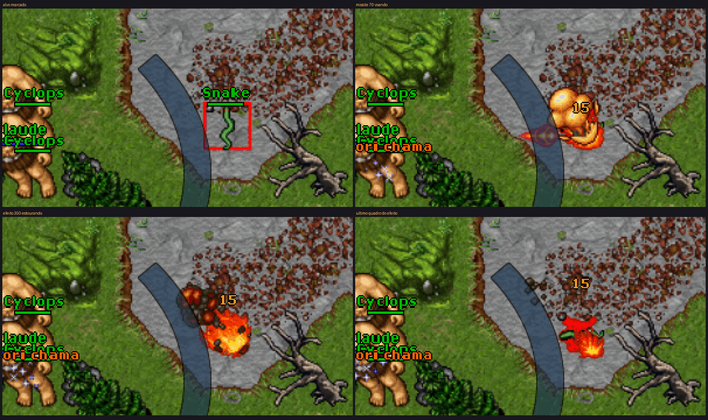
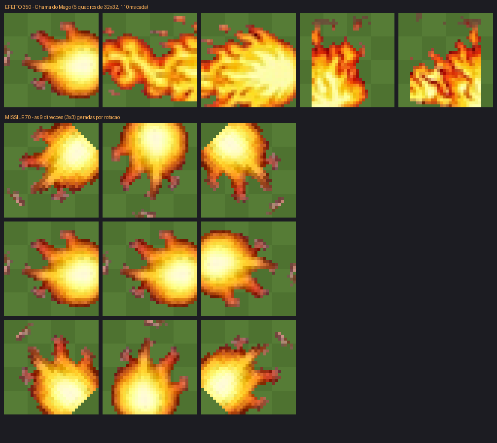

# Sprites próprios no client 15.x

Ferramentas para colocar arte sua dentro dos assets do Tibia 12+/15 — sem
`protoc`, sem editor externo e **sem recompilar o servidor**.



Acima: a magia `exori chama`, com o projétil e a explosão desenhados fora do
Tibia e injetados por essas ferramentas, rodando no Canary deste repositório
com o otclient do mehah falando 15.25.

## O modelo de sprite do Tibia

Isto é o que mais confunde quem vem de uma sprite sheet de outro jogo. Uma
tira de animação que atravessa a tela **não existe** no Tibia. O que existe:

| Peça | O que é | Formato |
|---|---|---|
| **magic effect** | a explosão, o brilho, a fumaça | **1 tile**, N quadros animados, cada um com duração em ms |
| **missile** (distance effect) | o projétil que vai de A até B | **1 sprite × 9 direções** (matriz 3×3), sem animação |
| **outfit** | o personagem | 4 direções × quadros de caminhada. Jogador **não tem** pose de ataque; só monstro tem frame group extra |
| **object** | itens, e o ícone da magia na hotkey | 1 sprite (ou animado, se for tocha/fogueira) |

Consequência prática: um jato de fogo que ocupa cinco tiles não é um sprite
largo — é uma **área de combate** desenhando o mesmo magic effect em cada
tile atingido, normalmente com atraso entre eles. O maior sprite que um
efeito ocupa é 64×64 (2×2 tiles).

## Os três arquivos que um sprite novo toca

```
assets/
├── sprites-<sha256>.bmp.lzma      BMP 384x384 BGRA, LZMA1 cru, cabeçalho CIP de 32 bytes
├── catalog-content.json           diz qual folha guarda qual faixa de spriteid
└── appearances-<sha256>.dat       protobuf: objetos, outfits, efeitos e missiles
```

O `tibia_assets.py` lê e escreve os três. O `appearances.dat` é manipulado
direto no formato de fio do protobuf — só precisamos **acrescentar**
mensagens no fim do arquivo, e como as categorias são campos `repeated` da
mensagem raiz, isso equivale a inserir no meio para qualquer leitor.

### Por que não precisa recompilar o servidor

O Canary registra os efeitos lendo o **próprio appearances.dat**:

```cpp
// src/game/game.cpp, Game::loadAppearanceProtobuf
registeredMagicEffects.push_back(static_cast<uint16_t>(m_appearancesPtr->effect(it).id()));
```

Ou seja: id novo no `data/items/appearances.dat` → id aceito no Lua. O enum
`CONST_ME_*` do C++ é só conveniência de nome; `posicao:sendMagicEffect(350)`
funciona sem ele.

## Uso

### 1. Desenhe os quadros

PNG com transparência, 32×32 (ou 64×64). Um arquivo por quadro do efeito;
para o missile, um único sprite **apontando para a direita**.

Se você só tem um mockup e quer prototipar, o `extrair_referencia.py`
recorta e converte — com a ressalva de que reduzir arte grande para 32×32
sempre perde detalhe:

```bash
python3 tools/sprites/extrair_referencia.py referencia.jpg tools/sprites/arte/fogo \
    --caixa 243,183,275,215 --caixa 660,168,720,224 --caixa 693,160,760,228 \
    --prefixo efeito
```

### 2. Injete

```bash
# magic effect: 5 quadros, 110 ms cada
python3 tools/sprites/novo_efeito.py efeito \
    --assets /caminho/do/client/assets \
    --dat-servidor data/items/appearances.dat \
    --id 350 --duracao 110 \
    tools/sprites/arte/fogo/efeito_0{1,3,4,6,5}.png

# missile: 1 sprite, as outras 8 direções saem de rotação
python3 tools/sprites/novo_efeito.py missile \
    --assets /caminho/do/client/assets \
    --dat-servidor data/items/appearances.dat \
    --id 70 tools/sprites/arte/fogo/missile_base.png
```

A ferramenta aloca os spriteids livres, grava a folha nova com o nome-hash,
atualiza o `catalog-content.json`, acrescenta a aparência nos dois
`appearances.dat` (client e servidor) e renomeia o do client pelo hash novo.



### 3. Use no datapack

```lua
local combat = Combat()
combat:setParameter(COMBAT_PARAM_EFFECT, 350)
combat:setParameter(COMBAT_PARAM_DISTANCEEFFECT, 70)
```

Exemplo completo e pronto para copiar:
[`data/scripts/spells/attack/chama_do_mago.lua`](../../data/scripts/spells/attack/chama_do_mago.lua).
Ele checa `Game.hasEffect()` antes de usar o id, então cai no efeito padrão
do Tibia se você ainda não rodou a ferramenta.

Depois de injetar, **reinicie o servidor e o client** — os dois só leem os
assets no boot.

## Detalhes do formato (para quem for mexer)

**Folha de sprite** — `sprites-<sha>.bmp.lzma`:

```
[0x00, X)     bytes 0x00 de enchimento (o total do cabeçalho é 32 bytes)
[X, X+5)      constante 70 0A FA 80 24
[X+5, 0x20)   tamanho do corpo LZMA em varint de 7 bits
depois        props(1) + dict_size(4 LE) + tamanho comprimido(8) + LZMA1 cru
descomprimido BMP 384x384, 32 bpp, BGRA, de baixo pra cima
```

O offset dos pixels sai dos bytes 10..13 do BMP. Magenta puro (`FF00FF`)
é lido como transparente pelo client. Cabem 144 sprites de 32×32 ou 36 de
64×64 por folha.

**Aparência de efeito** no `appearances.dat`:

```
Appearance { id, frame_group { sprite_info {
    pattern_width=1, pattern_height=1, pattern_depth=1, layers=1,
    sprite_id[]                       <- um por quadro
    animation { loop_type=1, loop_count=1, sprite_phase[]{min,max} }
    is_opaque=0, bounding_box_per_direction }}}
```

**Aparência de missile**: igual, mas `pattern_width=3, pattern_height=3`,
nove `sprite_id` (NO, N, NE, O, centro, L, SO, S, SE) e sem `animation`.

## Limites

- ids de efeito e missile são `uint16` no protocolo; o Tibia 15.25 usa até
  349 e 68, então o espaço acima disso é seu;
- o `data/items/appearances.dat` tem 4,8 MB — cada injeção que você
  **commitar** guarda um blob novo desse tamanho no git. Prefira versionar
  a arte e o comando, e regerar o `.dat`;
- não há como dar animação de conjuração ao outfit de um jogador: o
  protocolo não manda esse estado. Dá para monstro e para NPC.
